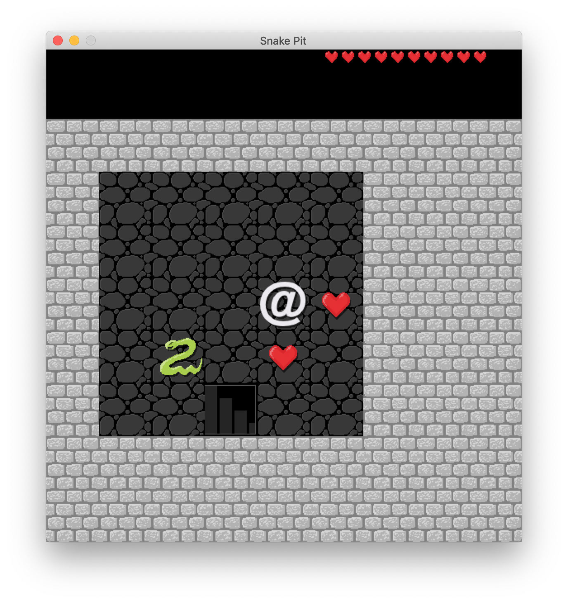

# Snake Pit



## Requirements

- Python 3.6.4
- Pygame 1.9.3

## Installation and running

```bash
# Clone this repository
git clone https://github.com/mes32/SnakePit.git

# Change into the project directory
cd SnakePit/

# Launch with python3
python3 snakepit
```

## Gameplay

- Move the player character '@' with the arrow keys
- Snakes only attack if you end your turn immediately next to them
- Hearts replenish your health
- Stairs lead down to the next floor
- Press **`z`** to wait a turn
- Press **`s`** to save game
- Press **`l`** to load a previous save game

## License

Program code under MIT License. This repository also includes the typeface Raleway by Matt McInerney licensed under the Open Font License.